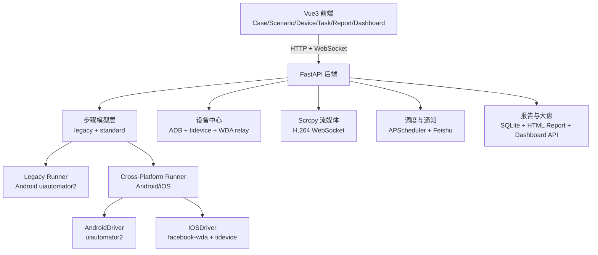

# AutoDroid-Pro 项目介绍（深度实现版）

> 适用场景：项目立项介绍、技术方案评审、团队内部培训、对外能力宣讲。

## 1. 项目定位

AutoDroid-Pro 是一个低代码 UI 自动化测试平台，核心模式是：

- Android 端可视化录制（点击页面直接生成步骤）
- 统一步骤模型（标准步骤 + 兼容 legacy）
- Android / iOS 双端执行
- 多设备并发、定时调度、报告与通知闭环

它解决的不是“单次脚本执行”，而是把 `录制 -> 编排 -> 预检 -> 执行 -> 报告 -> 运营` 全流程工程化。

## 2. 核心价值

1. 降低自动化门槛：录制与步骤编排可视化，减少对代码能力依赖。  
2. 一套用例覆盖双端：通过跨端步骤模型分发到 Android / iOS。  
3. 执行前风险拦截：预检提前发现平台、定位器、变量、WDA、app 映射问题。  
4. 运行稳定性提升：设备状态治理、WDA relay、执行后状态恢复、失败截图保留。  
5. 可规模化运营：支持多设备并发、定时任务、飞书通知、运行大盘与告警。  

## 3. 功能全景（产品能力）

| 业务域 | 功能能力 | 关键实现 |
|---|---|---|
| 用例管理 | 用例 CRUD、复制、目录树组织、标签、变量 | `backend/api/cases.py`、`backend/api/folders.py` |
| 录制编排 | Android 截图录制、元素审查、交互录制、步骤拖拽编辑、单步执行 | `backend/main.py` `/device/*` + `frontend/src/components/DeviceStage.vue` `StepBuilder.vue` |
| 跨端执行 | 标准步骤下发 Android/iOS，容错策略控制流程 | `backend/drivers/cross_platform_runner.py`、`android_driver.py`、`ios_driver.py` |
| 场景编排 | 多用例串联、别名、变量上下文跨用例传递 | `backend/api/scenarios.py` |
| 并发运行 | 场景多设备并发批次执行，设备级预检过滤 | `backend/api/scenarios.py` `_schedule_concurrent_runs` |
| 调度中心 | DAILY/WEEKLY/INTERVAL/ONCE 定时策略，支持 UI 场景与 Fastbot 任务 | `backend/scheduler_service.py`、`backend/api/tasks.py` |
| 设备中心 | ADB+tidevice 一键同步、解锁、重启、截图、WDA 检测 | `backend/api/devices.py` |
| 流媒体 | Scrcpy H.264 WebSocket 推流、触控转发、多客户端广播 | `backend/device_stream/manager.py` |
| 报告中心 | 执行列表、详情、下载，DB 数据兜底生成 HTML 报告 | `backend/api/reports.py`、`backend/report_generator.py` |
| 运行大盘 | KPI、趋势、状态分布、失败 Top、告警、即将执行任务 | `backend/api/reports.py` `/api/reports/dashboard/overview` |
| 稳定性探索 | Fastbot 智能探索、性能曲线、Crash/ANR 统计 | `backend/api/fastbot.py`、`backend/fastbot_runner.py` |
| AI 能力 | 自然语言生成步骤（NL2Step）、日志 AI 根因分析 | `backend/api/ai.py`、`backend/api/log_analysis.py` |
| 配置与通知 | 系统配置中心、飞书测试报告卡片通知 | `backend/api/settings.py`、`backend/notification_service.py` |

## 4. 技术架构概览

### 技术栈

- 前端：Vue 3 + Element Plus + Vite + Pinia + ECharts  
- 后端：FastAPI + SQLModel (SQLite) + APScheduler  
- Android 自动化：uiautomator2 + ADB  
- iOS 自动化：facebook-wda + tidevice  
- 图像/OCR：OpenCV + PaddleOCR（兼容封装）  
- 实时通信：WebSocket（执行日志、Scrcpy 视频流）  

## 5. 核心实现机制（深度）

### 5.1 双执行架构并存与灰度开关

项目同时保留两套执行链路：

- Legacy（Android 传统链路）：`backend/runner.py`（`TestRunner` / `ScenarioRunner`）
- Cross-Platform（标准跨端链路）：`backend/drivers/cross_platform_runner.py`

通过 Feature Flags 控制灰度：

- `new_step_model`：启用标准步骤模型读写
- `cross_platform_runner`：执行入口切换到跨端 Runner
- `ios_execution`：是否允许 iOS 执行

对应实现：`backend/feature_flags.py`，读取 `SystemSetting` 动态生效。

### 5.2 标准步骤模型与 legacy 兼容迁移

标准步骤实体：`backend/models.py::TestCaseStep`，核心字段：

- `action`、`args`、`timeout`、`error_strategy`
- `execute_on`（平台允许列表）
- `platform_overrides`（平台定位器覆盖）

兼容策略：

- 存量 `TestCase.steps`（legacy JSON）继续保留
- 标准表优先读取；缺失时可从 legacy 自动构建
- 前端保存时“双写”：先保存 legacy，再尝试 `PUT /cases/{id}/steps` 落标准步骤
- 标准保存失败时前端会告警并保留兼容数据

核心文件：

- `backend/step_contract.py`（标准/legacy 双向转换）
- `backend/api/cases.py`（双写与同步逻辑）
- `frontend/src/stores/useCaseStore.js`（前端保存/加载兼容策略）

### 5.3 跨端定位解析与动作分发

定位解析由 `backend/locator_resolution.py` 统一处理：

- 优先平台显式覆盖 `platform_overrides.{platform}`
- 回退 Android 定位
- iOS 支持从 Android `text/description` 自动推导 `label/name` 候选

动作分发由 `CrossPlatformRunner._dispatch` 完成，统一支持：

- `click`、`input`、`wait_until_exists`
- `assert_text`、`assert_image`
- `click_image`、`extract_by_ocr`
- `sleep`、`swipe`、`back`、`home`
- `start_app`、`stop_app`

并内置定位候选 fallback、OCR 提取重试、失败截图采集。

更完整的动作矩阵、参数规则与平台差异见：`docs/EXECUTION_SPEC.md`。

### 5.4 变量流转机制

变量来源：

- 环境变量（`Environment` / `GlobalVariable`）
- 用例变量（`TestCase.variables`）
- 运行时导出变量（如 `extract_by_ocr` 的 `output_var`）

渲染规则：

- 占位符格式 `{{KEY}}`，由 `backend/utils/variable_render.py` 渲染
- 未命中变量不会硬替换，预检可拦截未解析占位符

场景执行时，前序用例导出的变量会写入场景上下文并传给后续用例。

### 5.5 容错策略（error_strategy）语义

- `ABORT`：步骤失败立即终止
- `CONTINUE`：标记失败但继续后续步骤/用例
- `IGNORE`：失败降级为 warning，继续执行

该语义在 legacy 与 cross-platform 执行链路中均保持一致。

### 5.6 预检体系与错误码

预检核心在 `backend/cross_platform_execution.py`，覆盖：

- 平台允许运行校验（`execute_on`）
- 平台动作支持校验
- 定位器完整性校验
- 参数结构校验
- 未解析变量占位符校验
- `app_key` 到平台 app_id 映射校验
- iOS WDA 健康校验

关键错误码：

- `P1001_PLATFORM_NOT_ALLOWED`
- `P1002_ACTION_NOT_SUPPORTED`
- `P1003_SELECTOR_MISSING`
- `P1004_APP_MAPPING_MISSING`
- `P1005_WDA_UNAVAILABLE`
- `P1006_INVALID_ARGS`
- `S1001_SCENARIO_PRECHECK_FAILED`
- `P2001_RECORDING_ANDROID_ONLY`
- `P2002_ADB_ANDROID_ONLY`
- `P3001_FASTBOT_ANDROID_ONLY`
- `P3002_WDA_IOS_ONLY`

### 5.7 场景级预检与设备过滤

场景执行前，系统会逐设备预检所有用例：

- 前端先预检，过滤明显不可执行设备
- 后端 `run_scenario_api` 再次预检并返回 `blocked_prechecks`
- 如果所选设备全部被拦截，返回 `S1001_SCENARIO_PRECHECK_FAILED`

该设计避免“任务已启动但全部秒失败”的无效执行。

## 6. 平台能力矩阵与边界

| 能力 | Android | iOS | 说明 |
|---|---|---|---|
| 录制（`/device/dump/inspect/interact/execute_step`） | 支持 | 不支持 | iOS 调用会被边界拦截（`P2001/P2002`） |
| 用例执行 | 支持 | 支持（需开 `ios_execution` 且 WDA 健康） | 跨端 Runner 统一调度 |
| 场景并发执行 | 支持 | 支持 | 设备级预检过滤 |
| Fastbot 探索 | 支持 | 不支持 | `P3001_FASTBOT_ANDROID_ONLY` |
| WDA 检测 | 不适用 | 支持 | `POST /devices/{serial}/wda/check` |

结论：当前产品形态是“Android 录制 + Android/iOS 执行”。

## 7. 设备管理与稳定性保障

### 7.1 设备中心

`backend/api/devices.py` 提供：

- 一键同步：Android（ADB）+ iOS（tidevice）合并入库
- 设备状态：`IDLE / BUSY / OFFLINE / WDA_DOWN`
- 设备命名、截图、解锁、重启

### 7.2 iOS WDA 管理

WDA URL 解析优先级：

1. `ios_wda_url.{serial}`
2. `ios_wda_url_map`
3. `ios_wda_url`
4. 自动本地 relay

WDA relay 由 `backend/wda_port_manager.py` 管理，端口范围 `8200-8299`，支持多设备并发隔离。

### 7.3 执行后状态恢复

执行完成后调用 `restore_device_status_after_execution`：

- Android 一般恢复 `IDLE`
- iOS 会复查 WDA 健康，失败则标记 `WDA_DOWN`

### 7.4 强制解锁与执行中止

`POST /devices/{serial}/unlock` 会：

- 触发 Python 侧中止事件（终止运行中的 Runner）
- Android 侧清理残留进程（Fastbot/Monkey/uiautomator2）
- 回收设备状态，降低“设备卡 BUSY”概率

## 8. Scrcpy 实时流媒体能力

设备流管理器 `backend/device_stream/manager.py` 负责：

- USB 设备热插拔监听（`adbutils.track_devices`）
- 自动部署 `scrcpy-server.jar`
- H.264 帧读取与 WebSocket 广播
- 触控事件转发
- 新客户端连接时下发缓存 `SPS/PPS`

API/WS：

- `GET /devices`、`GET /devices/{serial}`
- `POST /devices/{serial}/touch`
- `WS /ws/scrcpy/{serial}`

## 9. 调度、通知与可观测性闭环

### 9.1 定时调度

调度服务 `backend/scheduler_service.py` 支持：

- `DAILY` / `WEEKLY` / `INTERVAL` / `ONCE`

任务中心 `backend/api/tasks.py` 支持两类任务：

- UI 场景任务（执行前预检过滤设备）
- Fastbot 任务（稳定性探索）

任务配置通过 `strategy_config` 承载扩展字段（如 `_task_type`、`env_id`、Fastbot 参数）。

### 9.2 通知服务

`backend/notification_service.py` 提供：

- UI 执行结果飞书卡片（通过率、失败摘要、设备结果、报告链接）
- Fastbot 报告飞书卡片（Crash/ANR/CPU/Mem 概览）

### 9.3 报告与大盘

报告中心：

- 执行列表：`GET /api/reports/executions`
- 执行详情：`GET /api/reports/executions/{id}`
- 下载报告：`GET /api/reports/executions/{id}/download`（支持 DB 回填生成 HTML）
- 报告静态资源：`GET /api/report-assets/{path}`

Dashboard（`GET /api/reports/dashboard/overview`）输出：

- KPI：执行总量、通过率、失败场景数、平均耗时、运行中执行、空闲设备、启用任务
- 趋势：24h / 7d / 30d
- 状态分布：PASS/WARNING/FAIL/ERROR/RUNNING
- 失败场景 Top
- 告警：连续失败、设备离线、WDA_DOWN、任务异常
- 即将执行任务

## 10. Fastbot 稳定性探索专项

### 10.1 任务管理

`backend/api/fastbot.py` 提供：

- 任务创建、查询、删除
- 报告查询
- Android 设备列表（实时在线状态）
- 设备内存锁（避免同设备并发冲突）

### 10.2 执行引擎

`backend/fastbot_runner.py` 实现：

- 首次自动推送 Fastbot 资源到设备
- Monkey 命令构造（支持事件权重）
- 性能采集协程（CPU/Mem）
- Logcat 监控协程（Crash/ANR 去重）
- 可选“崩溃即停”
- 汇总 `avg/max CPU`、`avg/max Mem`、`total_crashes`、`total_anrs`

## 11. AI 能力

### 11.1 NL2Step（自然语言生成步骤）

`backend/api/ai.py`：

- 通过严格 Prompt 约束输出标准步骤 JSON
- 支持输出清洗、结构归一化、动作/参数校验
- LLM 不可用时自动 fallback 到模板步骤

前端入口：`StepBuilder.vue` 的 “AI 智能生成测试步骤”。

### 11.2 日志 AI 根因分析

`backend/api/log_analysis.py`：

- 先做日志清洗降噪（抽取关键堆栈）
- 对清洗结果做 MD5 缓存，减少重复调用
- 调用 OpenAI 兼容接口返回 Markdown 诊断结果

前端入口：`FastbotReportDetail.vue` 的日志弹窗中“一键 AI 分析”。

## 12. 端到端典型流程

### 12.1 用例流（录制 -> 执行 -> 报告）

1. 设备中心同步 Android 设备。  
2. 用例编辑页选择设备，`/device/interact` 录制生成步骤。  
3. `StepBuilder` 补充动作参数、容错策略、OCR/图像步骤。  
4. 保存时 legacy 与标准步骤双轨持久化。  
5. 运行前执行 `precheck`，拦截不可执行步骤。  
6. 通过 WebSocket 或后台任务执行。  
7. 生成 HTML 报告并在报告中心查看。  

### 12.2 场景流（编排 -> 多设备并发）

1. 场景中按顺序编排多个用例。  
2. 每台目标设备先做场景预检。  
3. 可执行设备进入并发批次，失败设备写入 `blocked_prechecks`。  
4. 运行中保留步骤级结果与截图，完成后聚合场景报告。  

### 12.3 定时流（任务 -> 通知）

1. 任务中心配置调度策略与设备。  
2. 到点由 APScheduler 触发。  
3. UI 任务先做预检过滤，再执行批次。  
4. 执行完成后自动发送飞书卡片通知。  

## 13. 数据模型（核心表）

| 表 | 作用 |
|---|---|
| `TestCase` | 用例主体（含 legacy 步骤、变量、标签、最近运行状态） |
| `TestCaseStep` | 标准跨端步骤模型（执行主数据） |
| `TestScenario` / `ScenarioStep` | 场景与用例编排关系 |
| `TestExecution` / `TestResult` | 执行记录与步骤结果 |
| `Device` | 设备资产与实时状态 |
| `ScheduledTask` | 定时任务配置 |
| `FastbotTask` / `FastbotReport` | Fastbot 任务与报告 |
| `Environment` / `GlobalVariable` | 环境变量库 |
| `AppPackage` | 安装包资产 |
| `SystemSetting` | 全局配置与 Feature Flag 存储 |

## 14. 安全与权限机制

- 认证：OAuth2 Password + JWT（Bearer）  
- 鉴权：通过依赖注入校验当前用户  
- 角色：支持 `admin/user`（用户管理接口受角色限制）  
- 前端拦截：`401` 自动清理 token 并跳转登录  

> 生产部署建议：替换默认密钥与默认管理员初始密码，开启 HTTPS 与最小权限策略。

## 15. 发布与运维建议（灰度顺序）

建议按以下顺序灰度上线：

1. 开启 `new_step_model`：先完成步骤模型双轨稳定。  
2. 开启 `cross_platform_runner`：先在 Android 小流量验证跨端链路。  
3. 开启 `ios_execution`：WDA 运维稳定后逐步引入 iOS 执行。  

配套监控建议：

- 场景预检拦截率（特别是 `P1003/P1004/P1005`）
- `WDA_DOWN` 设备占比与恢复时长
- 任务逾期未触发数量
- 连续失败场景 Top

## 16. 项目边界与当前形态总结

- 当前明确定位：`Android 录制 + Android/iOS 执行`。  
- iOS 录制不在支持范围内（仅执行）。  
- Fastbot 仅 Android 支持。  
- 跨端能力依赖标准步骤模型与预检，建议将预检作为运行前必经流程。  

---

## 附：关键代码入口（便于技术评审快速定位）

- 后端入口：`backend/main.py`  
- 跨端执行核心：`backend/cross_platform_execution.py`  
- 跨端 Runner：`backend/drivers/cross_platform_runner.py`  
- 标准步骤契约：`backend/step_contract.py`  
- 用例/场景 API：`backend/api/cases.py`、`backend/api/scenarios.py`  
- 设备中心：`backend/api/devices.py`  
- 调度任务：`backend/api/tasks.py`、`backend/scheduler_service.py`  
- 通知服务：`backend/notification_service.py`  
- 报告与大盘：`backend/api/reports.py`  
- Fastbot：`backend/api/fastbot.py`、`backend/fastbot_runner.py`  
- AI：`backend/api/ai.py`、`backend/api/log_analysis.py`  
- 前端核心：`frontend/src/components/DeviceStage.vue`、`StepBuilder.vue`、`LogConsole.vue`、`frontend/src/views/*`  
